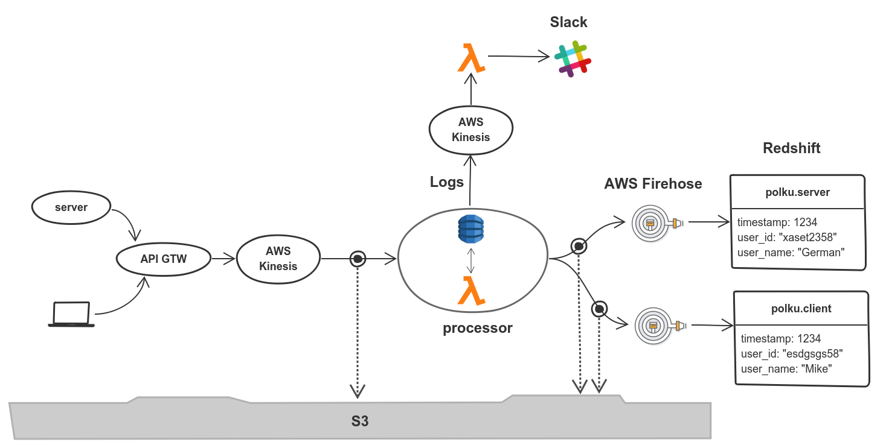

# Polku Proof-of-Concept

[](https://travis-ci.org/FindHotel/polku-poc)

__NOTE:__ This is still work in progress. Please come back in a few days!


This proof of concept implements the following streaming architecture:



The architecture above implements an app that does the following:

* Ingests events from two sources: `server` and `client`.
* Translates the user IDs in the events coming from the server into user names
* Delivers all `client` events to a table called `polku_poc.client` in Redshift.
* Delivers all `server` events to a table called `polku_poc.server` in Redshift.
* Logs when a user is named for the first time.
* Forwards all log events to Slack.


## Prerequisites

### Configure the AWS CLI

You should have configured the [AWS CLI][awscli] with a profile that has enough rights to deploy all the components of this infrastructure environment. You will also need a S3 bucket where that same CLI profile has read and write access.

[awscli]: https://aws.amazon.com/cli


### Python 3.6

This PoC uses the Python3.6 runtime in AWS Lambda. That means that to be able to run the tests below you will need to install that Python version on your local machine. I recommend you use [pyenv][pyenv] to manage and install multiple Python versions on your system. With pyenv installing the required Python version is as easy as:

```
pyenv install 3.6.0b2
```

[pyenv]: https://github.com/pyenv/pyenv


### Install the deployment dependencies

```
make install
. .env/bin/activate
humilis configure --local
```


### Environment variables

The following environment variables are needed to deploy all the feature of this PoC:


| variable             | description                                           |
| :------------------- | :---------------------------------------------------- |
| HUMILIS_BUCKET       | A S3 bucket for deployment artifacts                  |
| HUMILIS_AWS_REGION   | The AWS region, e.g. `eu-west-1`                      |
| REDSHIFT_HOST        | The hostname of your Redshift cluster master node     |
| REDSHIFT_PORT        | The port where the Redshift master node is listening  |
| REDSHIFT_DB          | The name of the Redshift database                     |
| REDSHIFT_USER        | The Redshift username                                 |
| REDSHIFT_PWD         | The Redshift password                                 |
| SENTRY_DSN           | The [Sentry][sentry] DSN                              |
| SLACK_TOKEN          | The token to access Slack's web API                   |
| SLACK_CHANNEL        | The name of the channel where messages will be posted |

Note that you will need to manually create the `HUMILIS_BUCKET` S3 bucket before attempting to deploy this Polku PoC.


## Deployment

I have extracted the most important deployment parameters into a [parameters.yaml.j2][./parameters.yaml.j2] file. A brief explanation of the purpose of each parameter can be found in the comments embedded in the parameters file. You can edit the deployment parameters as you see fit. Then:

```bash
polkupoc --stage DEV appy
```

The command above will deploy to a _stage_ named `DEV`. You can have multiple parallel (identical) deployments by using a different deployment stage.


## Contact

If you have questions, bug reports, suggestions, etc. please create an issue on
the [GitHub project page][github].

[github]: http://github.com/FindHotel/polku-poc
